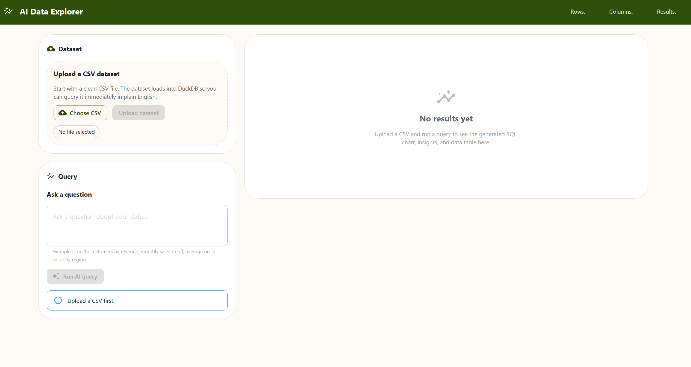
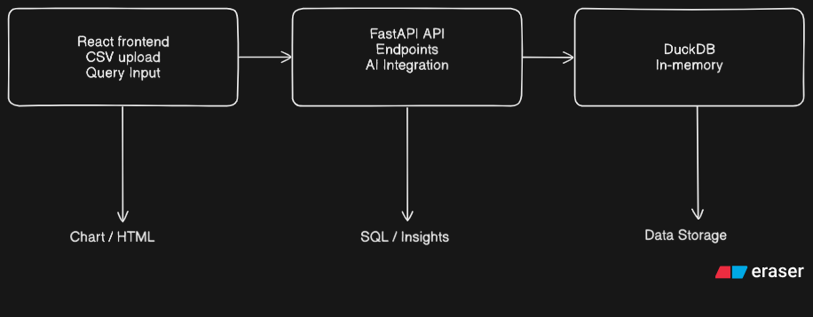
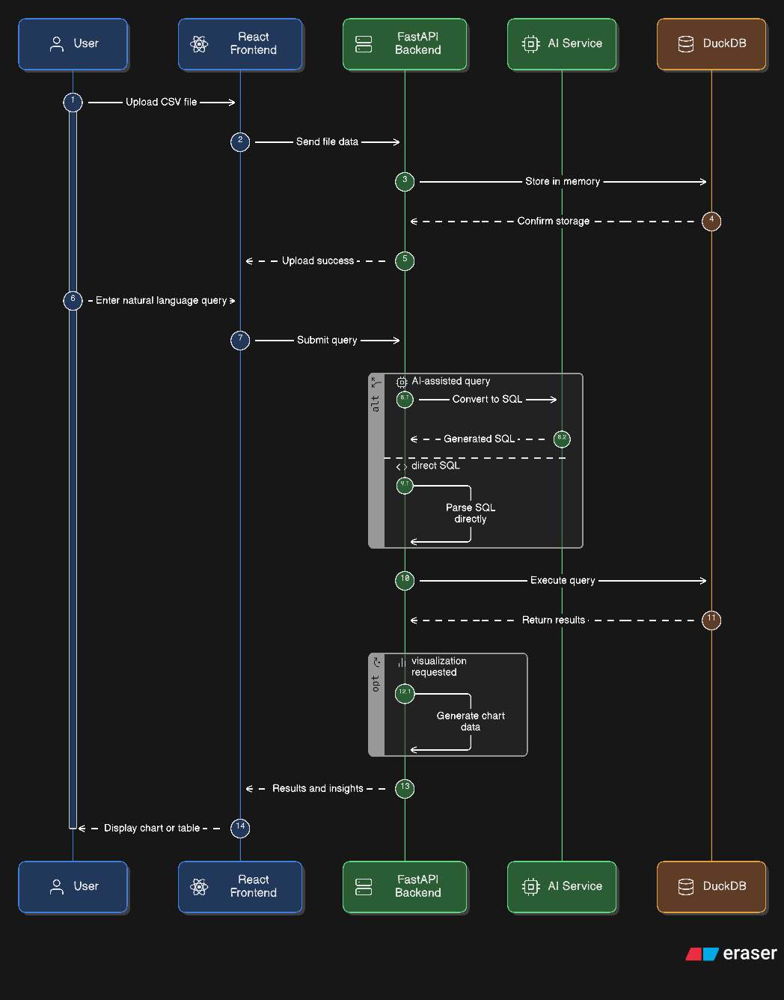

# AI-powered Data Explorer
A simple web app to explore CSV data with natural language queries, chart visualization, and data insights.



## Features
- Upload CSV files through a web interface
- Execute queries using natural language
- Generate SQL queries automatically
- Visualize query results with charts
- Display insights from the data

## Project Structure
```zsh
project/
├── backend/ # FastAPI backend
├── frontend/ # React frontend
└── README.md
```
## Diagrams
Here are some diagrams explaining the project:

### High Level Architecture
verview of how the frontend, backend, and database interact.


### Seqeunce Diagram
Step-by-step flow of a CSV query from user input to chart visualization.


## Getting Started

### Backend

1. Create a virtual environment:

```zsh
python -m venv venv
source venv/bin/activate  # Linux/Mac
venv\Scripts\activate     # Windows
```

2. Install dependencies:
```zsh
pip install -r backend/requirements.txt
```

3. Run the backend:
```zsh
uvicorn backend.main:app --reload
```
The backend runs on http://localhost:8000.

### Frontend

1. Navigate to frontend:
```zsh
cd frontend
npm install
npm start
```
The frontend runs on http://localhost:3000.

<!--2. Usage

- Upload a CSV file
- Enter a question about your data in plain English
- See results, charts, and insights
-->
## Notes

This is an MVP demo for educational purposes.

<!-- The project uses in-memory storage (DuckDB) and is intended for local use. -->
